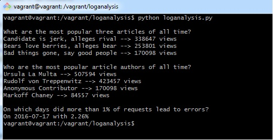

# Logs Analysis Project

> Sekhar Gogineni

## Project
This project is to create a reporting tool that prints out reports (in plain text) based on the data in the database. This reporting tool is a Python program using the psycopg2 module to connect to the database.

## Reports Generated
1. What are the most popular three articles of all time? Which articles have been accessed the most? Present this information as a sorted list with the most popular article at the top.
2. Who are the most popular article authors of all time? That is, when you sum up all of the articles each author has written, which authors get the most page views? Present this as a sorted list with the most popular author at the top.
3. On which days did more than 1% of requests lead to errors? The log table includes a column status that indicates the HTTP status code that the news site sent to the user's browser. (Refer to this lesson for more information about the idea of HTTP status codes.)

## Running the program

    In the vagrant directory, start the VM by using the command vagrant up.
    log into vagrant using vagrant ssh.
    Load the database with the command psql -d news -f newsdata.sql
    Run python loganalysis.py
    Output should be displayed.(check below screen print)

Output

